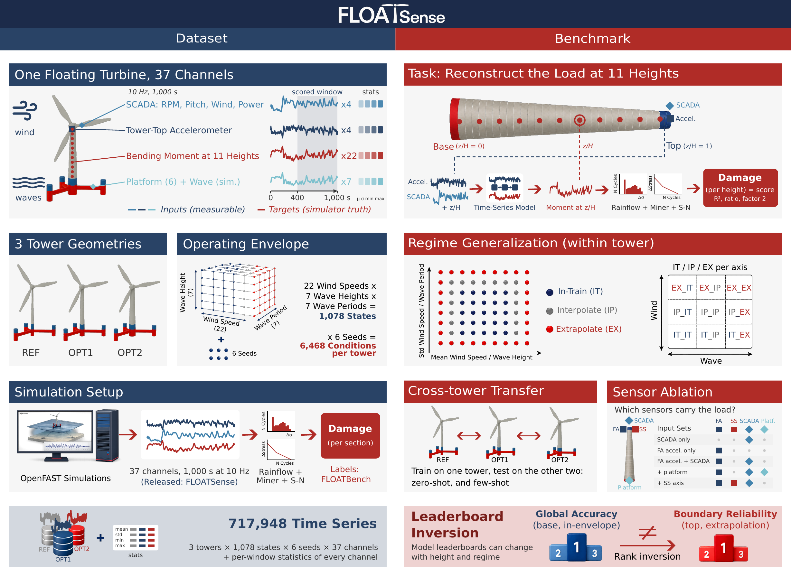
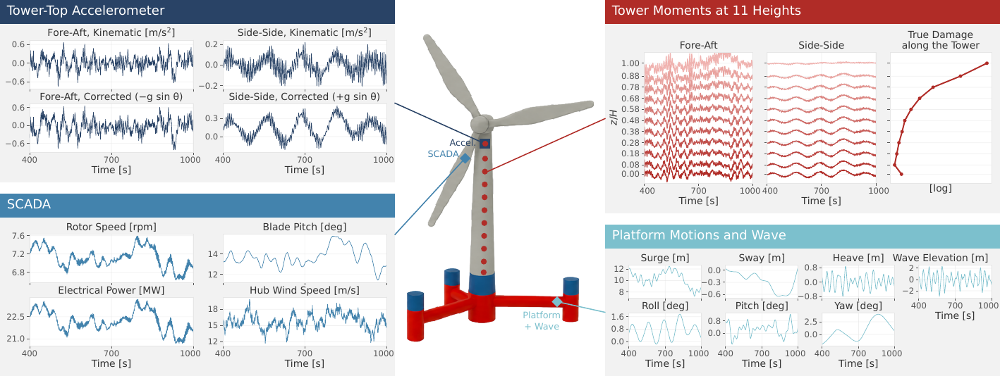
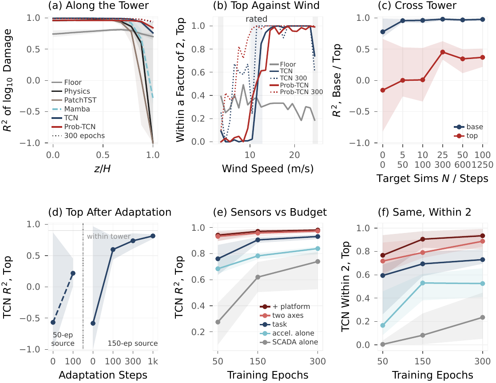
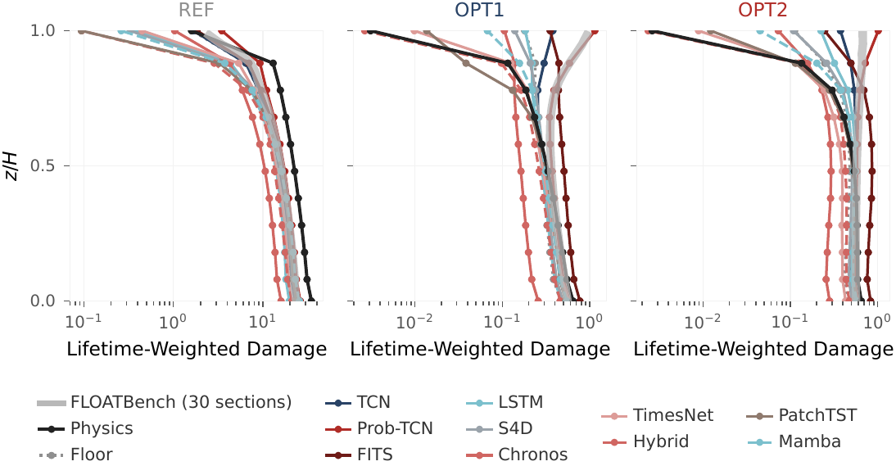

<p align="center">
  
</p>

# FLOATSense: A Time-Series Dataset and Benchmark for Fatigue Load Reconstruction on Floating Offshore Wind Turbine Towers
<p align="center">
  <a href="https://huggingface.co/datasets/DeCoDELab/FLOATSense">
    
  </a>
  <a href="https://github.com/Joao97ribeiro/FLOATBench">
    
  </a>
  <a href="https://opensource.org/licenses/MIT">
    
  </a>
  <a href="https://creativecommons.org/licenses/by/4.0/">
    
  </a>
</p>

<p align="center"><strong>Reconstruct the tower bending moment of a 22 MW floating wind turbine from a tower-top accelerometer and SCADA, and score it by the fatigue damage it implies.</strong></p>

**FLOATSense** is a public dataset and benchmark for fatigue load
reconstruction on floating offshore wind turbine (FOWT) towers. It
releases **717,948 time series at 10 Hz** from the **19,404 OpenFAST
simulations** of [FLOATBench](https://github.com/Joao97ribeiro/FLOATBench)
on three 22 MW tower geometries: 37 channels per simulation, with the
accelerometer and SCADA signals as inputs and the fore-aft bending
moment at **eleven heights** as target. A reconstruction is scored by
the fatigue damage it implies, not by waveform error. The dataset is
hosted on Hugging Face at
[`DeCoDELab/FLOATSense`](https://huggingface.co/datasets/DeCoDELab/FLOATSense);
this repository contains the benchmark code, the physics baseline, the
20 learned models, the evaluation harness, and the scripts to reproduce
the paper results.

<p align="center">
  
</p>


## FLOATSense Paper

**FLOATSense** is presented in the paper *FLOATSense: A Time-Series
Dataset and Benchmark for Fatigue Load Reconstruction on Floating
Offshore Wind Turbine Towers*, which fully describes the dataset, the
task, the evaluation protocols and the results.

Twenty learned models in eight families and a field-validated physics
baseline are evaluated within tower, across towers zero-shot and
few-shot, and under sensor ablation. **Sensor-level leaderboards
mislead**: the base of the tower does not separate the models and its
leaders collapse at the top, where at the declared budget only three
learned models beat a one-gain floor; longer training recovers the top
for convolutional models, not for attention and state-space ones; five
simulations of a new tower recover its base, not its top; and a second
accelerometer axis improves the top at every budget.


## What FLOATSense Provides

- **Dataset.** 6,468 simulations per tower (1,078 operating points on
  a $22 \times 7 \times 7$ wind/wave envelope $\times$ 6 turbulence
  seeds) on three 22 MW FOWT towers (`ref`, `opt1`, `opt2`), 37
  channels at 10 Hz over 1,000 s: tower-top accelerations, SCADA,
  platform motions, wave elevation, and fore-aft and side-side bending
  moments at 11 heights. Plus 22 parked runs per tower and per-window
  channel statistics. Every file is keyed by the FLOATBench `sim_id`
  (the parked runs by tower and run name).
- **Task.** From the gravity-corrected fore-aft tower-top acceleration,
  rotor speed, blade pitch, hub wind speed and a height $z/H$,
  reconstruct the fore-aft moment at that height over 400 to 1,000 s
  (scored window: 6,001 samples, 400.0 to 1,000.0 s, as in FLOATBench).
  One model serves the whole tower.
- **Damage-based scoring.** True and reconstructed moments pass through
  the pipeline that generated the FLOATBench labels (rainflow,
  DNV-RP-C203 S-N curve, Miner's rule), after a 3 Hz zero-phase
  Butterworth low-pass (order 4, forward and backward): the fatigue
  damage of these towers lies below 3 Hz (filtered and unfiltered true
  damage agree within 1% in 99.8% of the gauge-simulation pairs). Five
  metrics: $R^2$
  of $\log_{10}$ damage, median damage ratio, fraction within a factor
  of two, mean relative error, and within-condition correlation over
  the six realizations of an operating point.
- **Benchmark protocols.** Within tower on the regime-aware partition
  of FLOATBench (In-train / Interpolate / Extrapolate on the wind and
  wave axes), cross tower (zero-shot and few-shot), and sensor ablation.
- **Baselines and models.** The band-gain physics baseline of Pimenta
  et al. (2024) with parked calibration and a height factor, a one-gain
  floor, and 20 learned models in eight families (convolutional,
  recurrent, attention, state-space, spectral, period-folding,
  pretrained encoders, physics-anchored), all trained with one recipe.
- **Reproducible harness.** CLI scripts for training, physics
  calibration and the results table with cluster-bootstrap confidence
  intervals, all driven by `--flagfile` configs.

> **Metrics.** Throughout, $D$ is the Miner fatigue damage of one
> simulation at one height. The headline metric is $R^2$ of
> $\log_{10} D$, reported per height, per regime cell and per tower.

## What's in this repo

```
floatsense/        Python package (data reader, models, training, physics baseline, metrics)
scripts/           Pipeline entry points (see "Scripts" below)
hpo/               Validation-tuned track: search, confirmation, test, leaderboard
splits/            Model-selection and few-shot splits (lists of sim_id, same on every tower)
towers/            ElastoDyn tower mass density of each tower (physics height factor)
docs/              Figures used in this README
tests/             CPU tests (python -m unittest discover tests;
                   FLOATSENSE_DATA=data/FLOATSense also checks the labels)
environment.yml    Conda environment (Python 3.11 + GPU PyTorch)
requirements.txt   Pinned runtime dependencies
```

Inside `floatsense/`:

```
release.py     reader of the released Parquet dataset (shards, metadata, sections, splits, parked runs)
data.py        torch dataset of (inputs, condition, target) windows
models.py      the floor and the 20 learned models
trainer.py     training recipe and damage evaluation
physics.py     band-gain physics baseline and its parked calibration
heights.py     physics height factor along the tower
fatigue.py     damage metric: 3 Hz zero-phase low-pass, rainflow, S-N curve, Miner's rule
metrics.py     damage metrics and cluster bootstrap
```

## Scripts

Each folder under [`scripts/`](./scripts) is a pipeline stage; the
three benchmark stages have their own `run.py` and a `--flagfile`
`config.cfg`. Run every command from the repository root (the scripts
add it to the Python path; for the Python snippets below, run them from
the root or `export PYTHONPATH=$PWD`):

- [`scripts/physics/`](./scripts/physics): calibrate the physics
  baseline on a tower (C1 from the parked runs, the other five constants
  from the training split) and score it at the 11 gauges; zero-shot with
  `--source`, few-shot with `--train_split=fewshot/...`.
- [`scripts/train/`](./scripts/train): train one or more learned
  models on a tower and score them on its test split, and zero-shot on
  other towers (`--eval_towers`); few-shot adaptation from a checkpoint
  (`--init_checkpoint_dir`); sensor ablation (`--input_channels`).
- [`scripts/benchmark/`](./scripts/benchmark): score every run under
  an output tree: one long table per file, gauge and regime cell, with
  cluster-bootstrap 95% intervals. The scored tower is read from the path
  (`ref`, `opt1` or `opt2` in a directory name, `_zs_<tower>` or
  `<source>_to_<target>`); files without one are skipped with a warning.
- [`scripts/data/build_labels.py`](./scripts/data/build_labels.py):
  build the label files of the release (`metadata`, `sections`,
  `damage`) from the series and the FLOATBench dataset (maintainers
  only; the released files already contain them).

## Install

**Recommended (conda, GPU):**

```bash
git clone https://github.com/Joao97ribeiro/FLOATSense
cd FLOATSense
conda env create -f environment.yml
conda activate floatsense
pip install --no-deps momentfm==0.1.4   # MOMENT, only for --models=moment*
```

This installs Python 3.11, PyTorch 2.7.1 with CUDA 12.8, and the
dependencies of `requirements.txt`, including the pretrained encoders
Chronos. MOMENT is installed without its dependencies, whose pins clash
with the rest (`pip install --no-deps momentfm==0.1.4`, the last line
above). TimesFM is not included: `--models=timesfm` and
`timesfm_ft` need the TimesFM 2.5 PyTorch package installed separately
from [google-research/timesfm](https://github.com/google-research/timesfm)
(it provides `timesfm.timesfm_2p5_torch`). On first use the pretrained
encoders download their weights from the Hugging Face Hub
(`amazon/chronos-t5-small`, `AutonLab/MOMENT-1-small`,
`google/timesfm-2.5-200m-pytorch`), so that run needs internet access.

**Alternative (pip, CPU or existing venv):**

```bash
git clone https://github.com/Joao97ribeiro/FLOATSense
cd FLOATSense
pip install torch  # torch==2.7.1 for the paper setting
pip install -r requirements.txt
pip install --no-deps momentfm==0.1.4   # MOMENT, only for --models=moment*
```

## Dataset

The released Parquet files, schema, channel conventions and per-tower
layout are documented in the dataset README on Hugging Face:
[`DeCoDELab/FLOATSense`](https://huggingface.co/datasets/DeCoDELab/FLOATSense).

The three towers are:

- `ref`: IEA-22-MW reference tower (baseline)
- `opt1`: first redesign iterate (relaxed damage budget, $D \le 1.0$)
- `opt2`: final iterate ($D \approx 0.9$, targeting $D \le 0.9$)

The `opt1` and `opt2` geometries were produced by
[**FLOAT**](https://github.com/Joao97ribeiro/FLOAT), the fatigue-aware
tower design-optimization framework that the `ref` tower is redesigned with.

<p align="center">
  
</p>

```
FLOATSense/                          24.0 GB
├── ref/
│   ├── series-<k>-of-00017.parquet   sim_id, time_s, 37 channels; 400 simulations per shard, one row group each
│   ├── series_stats.parquet          mean, std, min, max of every channel over 400-1,000 s
│   ├── metadata.parquet              sim_id, wind_speed_id, wind_speed, mean_wind_speed, std_wind_speed,
│   │                                 wave_hs_id, wave_hs, wave_tp_id, wave_tp, wind_seed_id,
│   │                                 split, wind_group, wave_group, damage_weight
│   ├── sections.parquet              section_id, section_height_m, section_radius_m, section_thickness_m,
│   │                                 channel, gauge_height_m, z_over_h, gauge_radius_m,
│   │                                 gauge_thickness_m (the 11 scored sections)
│   └── damage.parquet                sim_id, section_id, damage (reference fore-aft damage at the
│                                     gauge: radius at the gauge, 3 Hz Butterworth low-pass)
├── opt1/                             same files
├── opt2/                             same files
├── parked.parquet                    the 22 parked runs (waves only) of each tower
├── assets/                           figures of the dataset card
└── README.md                         dataset card (schema, channels, OpenFAST mapping)
```

Column names and order follow FLOATBench, so a run joins its FLOATBench
rows on `sim_id` (and `section_id`). The 11 gauges are FLOATBench
sections 1, 3, 6, ..., 27, 30.

**Radius of the damage.** The stress at a gauge uses the outer radius at
the gauge height and the wall thickness of the section that contains it
(`gauge_radius_m`, `gauge_thickness_m` in `sections.parquet`, written by
`scripts/data/build_labels.py --gauge_profile` from the gauge profile of
the OpenFAST campaign), so the stress is taken where the moment is
recorded. The 30-section FLOATBench labels instead interpolate the
moment to the mid-height of each section and use its mean radius.

### Download

```bash
# Option A: download with the HF CLI (one-time)
hf download DeCoDELab/FLOATSense --repo-type=dataset --local-dir=data/FLOATSense

# Check the download: read one simulation from Python
python -c "from floatsense import load_tower; \
  t = load_tower('data/FLOATSense', 'opt2'); print(t.load(1).shape, t.channels[:4])"
```

**Damage of a series.** The same code scores the true moment and any
prediction at a gauge (3 Hz zero-phase low-pass, radius at the gauge
height, DNV-RP-C203 S-N curve,
Miner's rule):

```python
from floatsense import load_tower
tower = load_tower("data/FLOATSense", "opt2")
true = tower.scored_moment(sim_id=1, gauge="tower_top")  # 400-1,000 s, 6,001 samples
tower.gauge_damage(true, "tower_top")       # = tower.damage().loc[1, 30]
tower.gauge_damage(predicted, "tower_top")  # any reconstructed series
```

The configs expect the dataset at `data/FLOATSense` (for a copy elsewhere:
`mkdir -p data && ln -s <path>/FLOATSense data/FLOATSense`); change
`--dataset_dir` otherwise.

**Lifetime weights.** `damage_weight` is the expected number of 600 s
windows a simulation represents over the 25-year service life; the
weights of the 6,468 simulations of a tower sum to 1,314,000, as in
FLOATBench. Lifetime damage at a section is
$\sum_i$ `damage_i * damage_weight_i`. The benchmark metrics use the
unweighted per-simulation damage.

## Quickstart

```bash
# Physics baseline on one tower (CPU, ~3-4 min): calibrate on train, score test;
# the log ends with base and top R2, all heights come from scripts/benchmark/run.py
python scripts/physics/run.py --flagfile=scripts/physics/config.cfg --tower=opt2

# One learned model on one tower, scored zero-shot on the other two (~10–12 min on one GPU)
python scripts/train/run.py --flagfile=scripts/train/config.cfg \
    --tower=opt2 --models=tcn --eval_towers=ref,opt1

# Results table of every run under outputs/
python scripts/benchmark/run.py --flagfile=scripts/benchmark/config.cfg
```

Model names (`--models`): `naive` (floor), `dlinear`, `tcn`, `unet`,
`lstm`, `transformer` (PatchTST), `itransformer`, `s4` (S4D), `mamba`,
`spectral`, `fits`, `fno`, `timesnet`, `chronos`, `moment`, `moment_ft`,
`timesfm`, `timesfm_ft`, `hybrid`, `hybrid_tcn`, `prob_tcn`.

**Training recipe**, identical for every model: 50 epochs of Adam at
$10^{-3}$, batch 16, mean squared error on the standardized moment,
4,096-sample crops (full window for the length-fixed models), no weight
decay, scheduler or early stopping, last epoch scored. Exceptions:
Mamba uses `--learning_rate=3e-4`; Prob-TCN trains on the Gaussian
likelihood. The hybrid models read the physics calibrated on the same
split (`outputs/physics/<tower>` for `train`, `<tower>_fs10_draw0` for
`fewshot/train_10_draw0`), so run the physics on that split first.

**Evaluation input**: every model trained on crops sees 6,000-sample
inputs at evaluation (`INPUT_LENGTH` in `floatsense/constants.py`), the
length the paper checkpoints were scored at; models whose zero padding,
period folding or pooling depends on the input length (PatchTST, TimesNet,
U-Net) would otherwise be scored on a length they handle differently. The
6,001-sample scored window is predicted from the inputs starting at its
first and at its second sample; the last sample of the second prediction,
shifted by the mean difference over the overlap, completes the first (a
Prob-TCN variance head is stitched before its single noise draw). Only
input from inside the scored window is used. Length-fixed models trained on
6,000 samples are predicted the same way; trained on the full window,
directly.

Training is deterministic by default (`--deterministic=True`): a rerun
of a seed on the same GPU type gives identical numbers. It makes cuDNN
training about three times slower (TCN: ~7 instead of ~2.5 min of
training); `--deterministic=False` is faster and is how the paper runs
were trained (see [Reproducibility](#reproducibility)).

### Hardware & runtime

The benchmarks were run on a single workstation; nothing in the
pipeline assumes a cluster.

| Resource | Paper setting | Notes |
| --- | --- | --- |
| GPU | 2 × NVIDIA RTX 4090 (24 GB), one run per GPU | Small models fit in a few GB; the pretrained encoders need more. |
| CPU | Intel Core i9-14900K (24 cores) | Rainflow counting of the evaluation runs in a process pool. |
| RAM | 128 GB available | One run reads one simulation at a time from the shards. |
| Disk | 24.0 GB dataset + a few MB per run | One checkpoint per model, tower and seed. |
| Wall-clock | 4–9 min per run for the small models (training and scoring), ~10–12 min with zero-shot on two towers | 10–60 min for the pretrained encoders, 142 min for Mamba; physics ~3–4 min per tower on CPU. |

### What lands in `outputs/`

```
outputs/
├── physics/<tower>[_<tag>]/
│   ├── calibration_fa.json            C1..C5, C_d and the transition frequency
│   ├── estimates_fa.csv               per-simulation estimates behind the medians
│   ├── profile.json                   height factor at the 11 gauges and the parked profile
│   └── damage_heights.csv             true and reconstructed damage at the 11 gauges, per test simulation
├── within/<tower>/seed<k>/
│   ├── <model>_fa.pt                  weights, normalization statistics, settings
│   ├── history_<model>_fa.json        training loss per epoch
│   ├── damage_comparison_<model>_fa.csv          true and reconstructed damage (and variance ratio) at the 11 gauges
│   ├── damage_comparison_<model>_fa_zs_<t>.csv   the same, zero-shot on tower <t>
│   └── summary_<model>_fa[_zs_<t>].json          R², median ratio and within-2 at the base (tower_bottom; at the target height with --height_targets=False)
├── fewshot/<source>_to_<target>/draw<k>/seed<s>/   adaptation runs (same files as within/)
├── ablation/<input set>/<tower>/seed<k>/           sensor-ablation runs (same files as within/)
├── val_select/<tower>/seed<k>/             model-selection runs scored on val/val
└── tables/results.csv                 every file x gauge x regime cell: metrics, 95% intervals,
                                       direction and num_dropped (simulations without a positive
                                       damage, left out of the metrics as in the paper)
```

Zero-shot physics runs (`<tower>_zs_<source>`) reuse the calibration of
the source tower, so they hold only `profile.json` and
`damage_heights.csv`.

### Protocols

```bash
# Within tower, three seeds
for s in 0 1 2; do
  python scripts/train/run.py --flagfile=scripts/train/config.cfg \
      --tower=opt1 --models=tcn --seed=$s --eval_towers=ref,opt2
done

# Cross tower, ten-shot: adapt the opt2 model on 10 ref simulations (100 steps)
python scripts/train/run.py --flagfile=scripts/train/config.cfg \
    --tower=ref --models=tcn --batch_size=4 \
    --train_split=fewshot/train_10_draw0 \
    --init_checkpoint_dir=outputs/within/opt2/seed0 \   # the opt2 run of the Quickstart
    --output_dir=outputs/fewshot/opt2_to_ref/draw0/seed0

# Physics ten-shot (constants recalibrated on 10 ref simulations; the paper's
# cross-tower physics) -> outputs/physics/ref_fs10_draw0
python scripts/physics/run.py --flagfile=scripts/physics/config.cfg --tower=ref \
    --train_split=fewshot/train_10_draw0

# Physics zero-shot, all constants (C1 included) and height profile of opt2
# applied to ref -> outputs/physics/ref_zs_opt2 (a diagnostic, not in the paper)
python scripts/physics/run.py --flagfile=scripts/physics/config.cfg --tower=ref --source=opt2

# Sensor ablation: both accelerometer axes and SCADA
python scripts/train/run.py --flagfile=scripts/train/config.cfg --tower=opt2 --models=tcn \
    --input_channels=tower_top_afa_mod,tower_top_ass_mod,rotor_speed,blade_pitch,wind_speed \
    --output_root=outputs/ablation/twoaxis

# Model selection on the held-out validation split (scored on val/val, which
# has no regime cells: the benchmark reports it under the 'all' group only)
python scripts/train/run.py --flagfile=scripts/train/config.cfg --tower=opt2 --models=tcn \
    --train_split=val/train --test_split=val/val --output_root=outputs/val_select
```

`--max_train_sims` / `--max_eval_sims` cap a run for a quick test; they
take the first simulations by `sim_id`, which for small caps (below 17
training and 50 test simulations) are one realization per operating
point, so the within-condition correlation of such a run is undefined.
Write quick tests to a separate `--output_root` (or delete them): the
benchmark table scores every run it finds under its `--output_root` and
writes `<output_root>/tables/results.csv`.

Field-style SCADA (the ten-minute statistics a turbine logs) is an
input set too: `stat:<channel>:<mean|std|min|max>` reads
`series_stats.parquet` and feeds the value as a constant channel.

### Flags of every experiment in the paper

All runs add `--flagfile=scripts/train/config.cfg --tower=<tower> --models=<model> --seed=<k>`
(seeds 0, 1, 2) to the flags below; Mamba always adds `--learning_rate=3e-4`.
`$SCADA` is `rotor_speed,blade_pitch,wind_speed`. Each experiment writes
to its own folder, `<output root>/<tower>/seed<k>` (the last column), so
runs never overwrite each other and the benchmark tells them apart.

| Experiment | Extra flags | Output |
| --- | --- | --- |
| Within tower (+ zero-shot) | `--eval_towers=<the other two>` | default `outputs/within` |
| Longer budgets | `--num_epochs=150` (or 300) | `--output_root=outputs/epochs150` |
| Ten-shot | `--train_split=fewshot/train_10_draw<k> --batch_size=4 --init_checkpoint_dir=outputs/within/<source>/seed0` | `--output_dir=outputs/fewshot/<source>_to_<tower>/draw<k>/seed<s>` |
| Few-shot budget curve (5 to 100 simulations: 50 to 1,250 steps) | as ten-shot with `--train_split=fewshot/train_<n>_draw0`, n = 5, 10, 25, 50, 100 | `--output_dir=outputs/budget/<source>_to_<tower>/<n>/seed<s>` |
| Accelerometer alone | `--input_channels=tower_top_afa_mod` | `--output_root=outputs/ablation/accel` |
| SCADA alone | `--input_channels=$SCADA` | `--output_root=outputs/ablation/scada` |
| Two accelerometer axes | `--input_channels=tower_top_afa_mod,tower_top_ass_mod,$SCADA` | `--output_root=outputs/ablation/twoaxis` |
| + platform motions | `--input_channels=tower_top_afa_mod,$SCADA,plat_surge,plat_sway,plat_heave,plat_roll,plat_pitch,plat_yaw` | `--output_root=outputs/ablation/platform` |
| + generator power | `--input_channels=tower_top_afa_mod,$SCADA,electrical_power` (two axes: add `tower_top_ass_mod` after the first) | `--output_root=outputs/ablation/power` |
| Field SCADA | `--input_channels=tower_top_afa_mod,stat:rotor_speed:mean,stat:rotor_speed:std,stat:blade_pitch:mean,stat:blade_pitch:std,stat:wind_speed:mean,stat:wind_speed:std` | `--output_root=outputs/ablation/fieldscada` |
| Model selection | `--train_split=val/train --test_split=val/val` (hybrids: physics run first with `--train_split=val/train`; that physics run is scored on the test split, only its calibration is used) | `--output_root=outputs/val_select` |
| Top only (diagnostic; not for the hybrids) | `--height_targets=False --target_channel=tower_top_mfa` | `--output_root=outputs/toponly` |
| Damage-aware loss (diagnostic) | `--loss=damage --damage_loss_weight=1.0` | `--output_root=outputs/damageloss` |

The hybrid models need the physics of the same split first
(`scripts/physics/run.py --tower=<tower> --train_split=<split>`); the
paper runs were trained with `--deterministic=False`.

### Bootstrap confidence intervals

The confidence intervals are percentile-bootstrap intervals
($B = 1{,}000$, 95%) whose resampling unit is the **operating
condition** (wind speed, $H_s$, $T_p$): each replicate draws the test
conditions with replacement and keeps all six realizations of each
drawn condition. The six realizations share their met-ocean state, so
resampling simulations one by one would understate the spread.

```python
import pandas as pd
from floatsense import cluster_bootstrap, load_tower
from floatsense.metrics import condition_key

df = pd.read_csv("outputs/within/opt2/seed0/damage_comparison_tcn_fa.csv")
tower = load_tower("data/FLOATSense", "opt2")
meta = tower.metadata.loc[df.sim_id]
ci = cluster_bootstrap(df.damage_true_tower_top.values,
                       df.damage_rec_tower_top.values,
                       condition_key(meta).values)
print(ci)
```

## Validation-tuned track

The benchmark trains every model with one fixed recipe (Adam, learning
rate 1e-3, 50 epochs). The validation-tuned track is a second
leaderboard: each of the 20 learned models gets the same tuning effort
and a longer training. It uses only the validation split (`splits/val`)
to choose, and opens the test split once, at the end. Every number of
the protocol (trials, epochs, seeds, splits, failures, workers) is a
named constant of [`hpo/constants.py`](./hpo/constants.py), quoted
below by name with its value; the search grids are in
[`hpo/search_space.py`](./hpo/search_space.py).

1. **Search** ([`hpo/search.py`](./hpo/search.py)): one Optuna study
   per model and tower, `N_TRIALS` (30) counted trials for every model,
   the first `N_STARTUP` (7) random, then TPE. A trial trains on
   `val/train` for `EPOCHS_TRIAL` (100) epochs and is scored by the
   validation R² of log10 damage (mean of the 11 gauges, the benchmark
   metric) at its last epoch; a median rule stops poor trials after
   `PRUNE_WARMUP` (50) epochs (not for the models in `NO_PRUNING`).
   Searched: the learning rate, weight decay (on/off and its value), a
   constant or cosine schedule with `WARMUP_EPOCHS` (5) of warm-up, and a
   few architecture knobs per model. Fixed for every model: AdamW,
   gradient clipping (`GRAD_CLIP`), the batch size, the crops, the loss,
   the inputs and the targets. Models above `MAX_PARAMS_M` (60) million
   trainable parameters are rejected before training (a failed trial, not
   counted). If a study's best trial comes after the `EXTEND_AFTER`-th
   (20th), the three studies of that model get `EXTEND_BY` (20) more
   trials.
2. **Confirmation** ([`hpo/confirm.py`](./hpo/confirm.py)): the `N_TOP`
   (2) best configurations of each study, frozen once, are retrained with
   `N_SEEDS` (3) seeds for `EPOCHS_FINAL` (300) epochs; the winner has
   the highest median validation score over the seeds.
3. **Test** ([`hpo/final.py`](./hpo/final.py)): each winner is retrained
   on the full training split with `N_SEEDS` seeds and scored once on the
   test split, into a sealed directory, in two variants: `primary_last`
   (primary, the headline: the last epoch) and `secondary_best`
   (secondary: the median best validation epoch of the confirmation,
   rounded to `BEST_EPOCH_ROUND`). The test opens only when every model
   and tower is trained (`READY_FOR_TEST.json`, written by the workers);
   a shelved model and tower (see *Failures and workers* below) is
   recorded as missing (`sealed/MISSING.json`), and so is a pair whose
   final seeds all diverged (`sealed/SKIPPED.json`).
4. **Leaderboard** ([`hpo/analyze.py`](./hpo/analyze.py)): the sealed
   runs are scored by the benchmark scorer (`scripts/benchmark/run.py`);
   per model, every metric at the base, z/H 0.78, the top and the mean
   of the 11 gauges (median over the seeds per tower, then mean over the
   towers), overall and per regime cell, the `TOP_K` (3) best models per
   criterion and the best model of each family, one folder per test
   variant. Only the models scored on all three towers with all their
   seeds are ranked; the others are listed below them, unranked, with
   `n_towers` and `missing_towers`. The selected configuration of each
   model and tower (`configs.csv`, with the kind and reason of a
   shelving), the best validation score against the number of counted
   trials of each study, and the GPU-hours of the track (`gpu_hours.csv`:
   per model, tower and phase, every attempt included, hard-killed ones
   and the test inference runs too, with totals) are written next to it.
   The naive floor and the physics baseline are not tuned: their scores
   are those of the fixed-recipe benchmark.

The trainer options of the track are plain flags of
`scripts/train/run.py`, off by default so the benchmark runs are
unchanged: `--weight_decay` (AdamW), `--schedule` and `--warmup_epochs`,
`--grad_clip`, `--model_kwargs` (e.g.
`hidden_channels=96,num_levels=7,dropout=0.1`; stored in the checkpoint),
`--val_score=damage` (prints `VAL epoch=... r2_mean=... r2_top=...
r2_base=...` lines), `--resume` (a resume state at every validation and
every `--checkpoint_seconds` of wall time, `CHECKPOINT_SECONDS` of
`floatsense/constants.py` by default, which the drivers and the worker
keep), `--max_params_m` and `--save_epochs`. The parameter cap does not
bind for the approved grids: the largest model, the U-Net, has 55 M
trainable parameters. Exit codes of `run.py` (`floatsense/constants.py`):

| Code | Meaning |
|---|---|
| 0 | Done. |
| 3 | `EXIT_DIVERGED`: a non-finite training loss (or damage-validation prediction). This guard is on with the default flags too; the published code finished such a run and saved a non-finite checkpoint, so the two differ only for runs that diverge. |
| 4 | `EXIT_TOO_LARGE`: more trainable parameters than `--max_params_m`. |
| 5 | `EXIT_STOPPED`: SIGUSR1 with `--resume`; the resume state was saved at the end of the epoch and a relaunch continues from it. |
| 6 | `EXIT_CONFIG_MISMATCH`: with `--resume`, the resume state in `--output_dir` was written with another run configuration (tower, task, recipe, training simulations or `--num_epochs`). A run is never extended in place: a longer run goes to a new `--output_dir`. |

The drivers need `optuna>=4`; `--dry_run` runs each of them on a CPU stub:

```bash
python hpo/search.py --model=tcn --tower=opt2 --dataset_dir=data/FLOATSense
python hpo/confirm.py --model=tcn --tower=opt2 --freeze   # then without --freeze
python hpo/confirm.py --model=tcn --tower=opt2 --summarize
python hpo/final.py --model=tcn --tower=opt2              # every model and tower
python hpo/final.py --open_test                           # once, at the end
python hpo/analyze.py --root=outputs/hpo --dataset_dir=data/FLOATSense
```

Each run directory holds `config.json` (the hyperparameters exactly as
passed to `run.py`, and the command line) and `attempts.json` (one entry
per attempt: start, end, seconds, host, GPU and status). The run
directory of a confirmation or final unit is its unit id under the root
(`confirm/<model>_<tower>/c<rank>_s<seed>`, `final/<model>_<tower>/s<seed>`);
search trials run in `trials/<model>_<tower>/t<number>`.

### Failures and workers

The track is meant for one machine with one or more GPUs: start one
worker per GPU on the same root, e.g.

```bash
CUDA_VISIBLE_DEVICES=0 python hpo/worker.py --root=outputs/hpo --models=all \
    --dataset_dir=data/FLOATSense --owner=gpu0
```

and `hpo/status.py` writes the status of the track (studies, workers alive
or dead, shelved units and studies, recent alerts). Workers on several
machines can share a root on a shared file system; launching and
restarting them is left to the launcher (`--owner` keeps the identity of
a worker across its restarts, `--restart` counts them). Every alert is a
record in `outputs/hpo/alerts/`, named by the unit id that
`hpo/pick.py --retry` accepts.

- **Crashes.** A crashed run is resumed from its checkpoint up to
  `MAX_ATTEMPTS` (3) times and then *shelved* (a `SHELVED` marker in its
  run directory, with the kind of its last failure). Preemptions and
  hardware faults resume without counting (up to `MAX_FREE_RETRIES`).
- **One retry.** A shelved unit gets one automatic retry
  `RETRY_SHELVED_AFTER` (3,600 s) after its shelving, with its failure
  counts reset; a second shelving is for good. Nothing is retried once
  `READY_FOR_TEST.json` or `sealed/` exists. An operator retries a unit
  or a study at once, even after a shelving for good, with
  `python hpo/pick.py --root=outputs/hpo --retry=final/tcn_opt2/s0` (a
  unit id as in the alerts and the status) or `--retry=search/tcn_opt2`
  (a study); this resets the failure counts, which removing a marker by
  hand would not.
- **Search failures.** A trial above the parameter cap is a failed draw,
  not counted; so is a trial out of memory, after one resume as a crash
  (another process may have held the GPU). A study stops drawing after
  `MAX_OVER_CAP` (20) draws above the cap, `MAX_OOM` (20) trials out of
  memory or `SHELVE_STUDY_AFTER` (3) shelved trials; with fewer than
  `N_TRIALS` counted trials it is then shelved (`shelved/<model>_<tower>.json`,
  with the kind `over_cap`, `oom` or `shelved_trials`), and for a kind in
  `RETRIED_KINDS` (shelved trials, out of memory) it gets the same single
  retry, counting only the failures after it. With its `N_TRIALS`
  counted trials a study is never shelved for that and its plan is
  frozen from the counted trials, except during an extension: a study
  stopped there by a kind in `RETRIED_KINDS` gets the single delayed
  retry first, and its plan is frozen only if it stops again. The plan
  records `n_trials_counted`, `target` and `stopped_early` (why it
  stopped before its target, with its kind), shown by the status and in
  `configs.csv`. A study is also shelved for good with too few eligible
  trials for a plan (`no_plan`), no finite median in the confirmation
  (`no_finite_median`), or a unit shelved for good (`unit_shelved`). The
  extension rule of a model waits while one of its studies is shelved
  with its retry pending; a study shelved for good is left out of it,
  has no winner and is missing in the test and the leaderboard.
- **Out of memory.** A confirmation or final unit out of memory is a
  crash like any other. `--min_gpu_gb` makes a worker refuse a GPU with
  less memory (`EXIT_BROKEN`), or whose memory is still unknown after
  `GPU_QUERY_TRIES` (3) queries (`EXIT_RESTART`).
- **Configuration mismatch.** A run whose resume state belongs to another
  configuration (`EXIT_CONFIG_MISMATCH`) is not shelved but held for an
  operator (a `CONFIG_MISMATCH` marker in its run directory); the worker
  goes on with other units. Remove the stale resume state (or the run
  directory), then the marker.
- **Errors of the worker.** After an exception of a driver the worker
  waits `--poll_seconds` and goes on. For a confirmation or final unit
  each one counts as a crash, so `MAX_ATTEMPTS` of them shelve it (kind
  `driver_errors`, with the single retry); a unit whose driver raised
  `MAX_ATTEMPTS` times in a worker is set aside by that worker for
  `RETRY_SHELVED_AFTER` (an alert), so it never starves the other units.
  Exceptions of the worker loop itself (advancing the phases, picking)
  are retried after the same wait, with an alert after
  `LOOP_ERRORS_ALERT` (3) in a row and a stop (`EXIT_RESTART`) after
  `MAX_LOOP_ERRORS` (10).
- **Damaged files.** An Optuna journal line torn by a kill or a power
  loss is cut off (kept next to the journal as `<journal>.torn.<time>`,
  with an alert) before the study is written again; a study that cannot
  be read is skipped with one alert while the other studies go on.
- **Restarts.** A lock or a claim of a process of the same machine that
  no longer exists is taken over at once, and the same `--owner` resumes
  its own unit at once (a lock of another `--restart` count of the same
  owner is taken back); any other lock or claim is stale after
  `STALE_SECONDS` (900) without a beat.

A worker exits with (`hpo/constants.py`):

| Code | Meaning | Launcher |
|---|---|---|
| 0 | Every unit of its models done or shelved for good (also `--max_units` or the file `outputs/hpo/STOP`). While work remains but nothing can be picked, a worker keeps polling (one alert after `--idle_minutes`). | Do not restart. |
| 98 | `EXIT_BROKEN`: a broken machine. Units of `WORKER_FAILURES` (3) different studies shelved in a row, each after failing before its first resume save (validation or `--checkpoint_seconds`), or a GPU below `--min_gpu_gb`. | Do not restart it on the same machine. |
| 99 | `EXIT_RESTART`: stopped. A signal, its lock lost, `MAX_LOOP_ERRORS` errors of the worker loop in a row, or GPU memory unknown under `--min_gpu_gb`. | Restart it; the same `--owner` resumes its unit. |

Runs save their resume state every `--checkpoint_seconds`, and a unit
whose last `NO_PROGRESS_ATTEMPTS` (3) attempts all stopped without a new
save gets an alert (lower `--checkpoint_seconds` for it).

Divergence follows two rules. In the confirmation a diverged seed counts
as minus infinity in the median of its configuration (so a configuration
with most seeds diverged cannot win). In the test a tower counts as
scored only with all `N_SEEDS` final seeds; a tower with fewer (a seed
diverged) keeps its score but is listed in `missing_towers` and its model
is unranked. A failed test scoring is listed in
`sealed/TEST_FAILURES.json` (and scored again by a new `--open_test`);
`hpo/analyze.py` stops while a seed of a pair that is not shelved has no
sealed marker.

## Reproducibility

- The reference damage in `damage.parquet` is computed on the inclusive
  400–1,000 s window (6,001 samples), the window of the evaluation of
  every model, of the physics baseline and of FLOATBench;
  `gauge_damage(scored_moment(...))` reproduces it exactly
  (`tests/test_damage.py`).
- The parked constant C1 is recomputed from `parked.parquet` and
  rounded to 0.1 MN s², as in the paper; the physics baseline reproduces
  the paper to $10^{-7}$.
- The paper runs were trained with `--deterministic=False`, where cuDNN
  convolutions are not bit-for-bit repeatable: in our reruns LSTM,
  PatchTST and the hybrid repeated the paper exactly, while TCN and
  Prob-TCN drifted within the spread of the seeds
  (Prob-TCN top $R^2$ on `opt1`: 0.80 and 0.84 in two reruns of seed 0,
  0.85 to 0.87 over the paper seeds). TCN on `opt2`, base $R^2$: 0.984, 0.991 and 0.992 in
  three reruns of seed 0, 0.987 to 0.992 over the three seeds of the
  paper; top $R^2$: 0.754 to 0.785 in reruns, 0.713 to 0.866 over the
  seeds. Compare a model with the paper through its three-seed median.
  With the default `--deterministic=True`, two runs of a seed are
  identical to each other (TCN on `opt2`: zero difference over the 4,740
  test simulations), though not to the paper's convolutional runs.

## Headline findings

**Within tower: the base does not separate the models, the top does.**
Ten of the 22 entries reach $R^2 \ge 0.95$ at the base and the first
seven lie within 0.023. At the top the same entries spread from $-2.3$
to 0.84 and the base ranking does not predict it: PatchTST and Mamba,
first at the base, fall below zero at the top, while TCN keeps
0.73–0.78 and Prob-TCN 0.82–0.86. Only three learned models beat the
one-gain floor at the top at the declared budget.

<p align="center">
  
</p>

**Over the design life the top governs the redesigns, and it is where
reconstruction fails.** On `opt1` the top carries 1.5 times the
lifetime damage of the base; PatchTST and Mamba keep 1 to 8% of it,
TCN 61 to 66%, and Prob-TCN over-predicts by 44 to 74%.

<p align="center">
  
</p>

**Cross tower: zero-shot keeps the ranking, not the level.** The
within-condition correlation stays at 0.84 to 0.95, so realizations are
ranked right and placed at the wrong level. Five target simulations
recover the base on every pair, into `ref` included; no adaptation
measured recovers the top.

**Sensors: the second accelerometer axis helps the top at every
budget**, while platform motions add little beyond it.

## License

Code released under the [MIT License](LICENSE.txt). Dataset on
Hugging Face is released under
[CC-BY-4.0](https://creativecommons.org/licenses/by/4.0/).


## Citation

If you use **FLOATSense** in your work, please cite the paper (reference
to be added on publication) and FLOATBench, whose simulation campaign it
builds on:

> *FLOATBench: A Dataset and Benchmark for Floating Offshore Wind
> Turbine Tower Fatigue.*
> João Alves Ribeiro, Bruno Alves Ribeiro, Francisco Pimenta,
> Sérgio M. O. Tavares, Faez Ahmed. arXiv:2605.25717, 2026.
> https://arxiv.org/abs/2605.25717


## Maintenance & Support

For issues, questions, or feature requests related to FLOATSense:
[FLOATSense Issues](https://github.com/Joao97ribeiro/FLOATSense/issues).


## Acknowledgements

The high-fidelity simulations underlying FLOATSense were produced
with [OpenFAST](https://github.com/OpenFAST/openfast) on the
[IEA-22-280-RWT](https://github.com/IEAWindSystems/IEA-22-280-RWT)
reference floating wind turbine. The physics baseline follows
Pimenta et al. (2024), *Renewable Energy* 223, 119981. We thank these
communities for keeping the underlying tools open.
